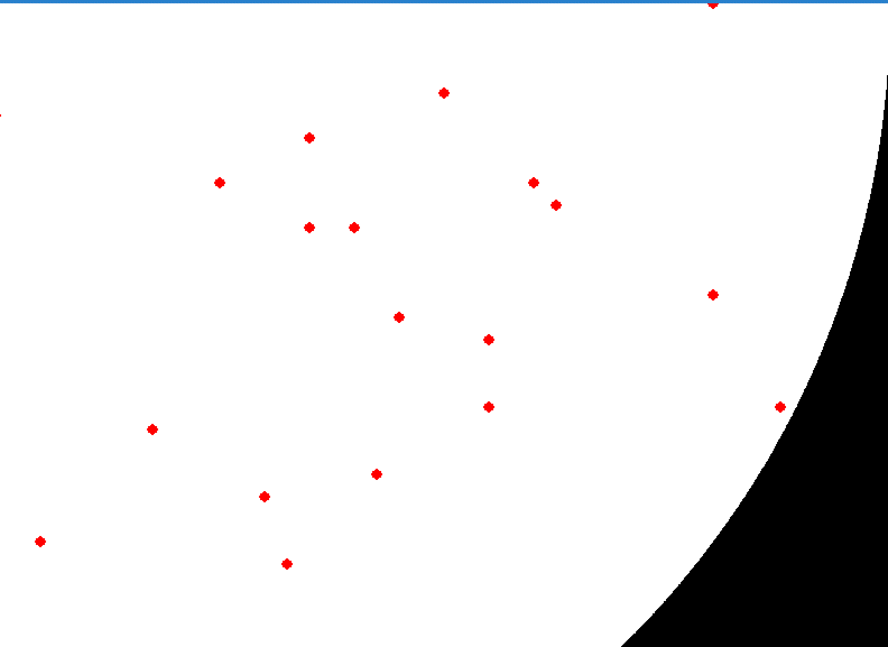

# Slowmatch

Slowmatch is an example python implementation of minimum weight embedded matching.

An *embedded matching* is a set of edges where marked nodes are adjacent to an odd number of edges and unmarked nodes are adjacent to an event number of edges.
There may also be boundary nodes, which can be adjacent to an even or odd number of marked edges.
The minimum weight embedded matching problem is very similar to the minimum weight perfect matching problem.
The algorithms for solving them are essentially the same.

Embedded matchings are interesting because the problem they represent still makes sense on continuous spaces,
and also they more directly represent solutions to the matching problem created by quantum errors in the surface code.



# Running the demo

1. Clone the repo.

    ```bash
    git clone git@github.com:Strilanc/slowmatch.git
    cd slowmatch
    ```
    
2. Create a virtual environment.

3. Install dependencies.

    ```bash
    python -m pip install -r requirements.txt
    ```

4. Run the demo.

    ```bash
    python slowmatch/demo.py
    # press [spacebar] to generate a new problem and match it
    # press [R] to replay a matching
    ```

5. [Optional] Run the demo with different options.

    E.g. change `CIRCLE = True` in `demo.py` to `CIRCLE = False`
    
